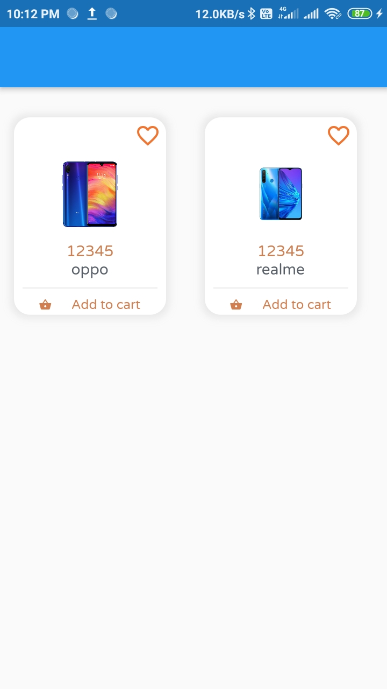

# Custom Card Grid View

A new Flutter package project.

## Getting Started

This project is a starting point for a Dart
[package](https://flutter.dev/developing-packages/),
a library module containing code that can be shared easily across
multiple Flutter or Dart projects.

For help getting started with Flutter, view our 
[online documentation](https://flutter.dev/docs), which offers tutorials, 
samples, guidance on mobile development, and a full API reference.
## Flutter package to Easy Implimaintaion of custom card grid view also provide *animated*, 🥰 *Attractive*, 🎨*stylish* custom card view.

<table style="width:100%">
  <tr>
    <th><b>1.Custom Card View. <b></b></th>
      
  </tr>
  <tr>
    <td></td>
  </tr>
</table>


# Introduction

**Custom_Cardgridview** library is built upon Flutter Custom Card Material Design library. This API will be useful to create rich, animated, beautiful Custom Card in Flutter  easily. 

<table style="width:100%">
  <tr>
    <th><b>1.Card _GridLayout<b></b></th>
    <th>2. Details</th>
  </tr>
  <tr>
    <td>This is Main window where you want to add Custom card_Grid View as you can see Below.</td>
    <td>This is Detais window after click on Custom card  as you can see below.</td> 
  </tr>
  <tr>
    <td align="center"></td>
    <td align="center"></td> 
  </tr>
</table>

 ## Use this package as a library
 
 ## 1. Depend on it
 
 Add this to your package's `pubspec.yaml` file:
 
 ```dart
 dependencies:
  custom_cardgridview: ^0.0.1
 ```
 
 ## 2. Install it
 
You can install packages from the command line:

with Flutter:

```cmd

$ flutter pub get

```
Alternatively, your editor might support `flutter pub get`. Check the docs for your editor to learn more.

## 3. Import it

Now in your Dart code, you can use:

```dart

import 'package:custom_cardgridview/custom_cardgridview.dart';

```


## Create Custom Card_GridView Instance

Custom Card_GridView are instantiated as follows.

## i. Custom Card_GridView -

`CustomCard` class is used to create Custom Card_GridView . Its dynamic `state` class is used to instantiate it. 


```dart
 body: GridCard(cardLayout:
      [
        CustomCard(
          imgPath: "assets/red.png",
          name: "oppo",
          price: "12345",
          isFavorite: false,
          added: false,
        ),
        CustomCard(
          imgPath: "assets/real.png",
          name: "realme",
          price: "12345",
          isFavorite: false,
          added: false,
          onPressed:(){
            //On tap on card Redirect To
          },
        )
      ]
      )
```
